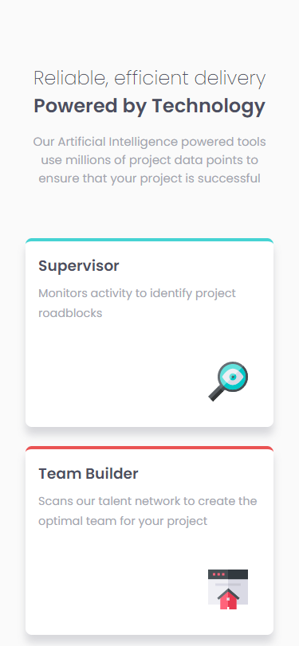

# Frontend Mentor - Four card feature section solution

This is a solution to the [Four card feature section challenge on Frontend Mentor](https://www.frontendmentor.io/challenges/four-card-feature-section-weK1eFYK). Frontend Mentor challenges help you improve your coding skills by building realistic projects.

## Overview

### The challenge

Users should be able to:

- View the optimal layout for the site depending on their device's screen size

### Screenshot

   
   

### Links

- Solution URL: [https://www.frontendmentor.io/solutions/four-card-challenge-3-hL5033feq](https://www.frontendmentor.io/solutions/four-card-challenge-3-hL5033feq)
- Live Site URL: [https://jimovan.github.io/four-card-feature/](https://jimovan.github.io/four-card-feature/)

### Built with

- Semantic HTML5 markup
- CSS custom properties
- SCSS
- Flexbox
- CSS Grid
- Mobile-first workflow

## Author

- Frontend Mentor - [@jimovan](https://www.frontendmentor.io/profile/jimovan)
